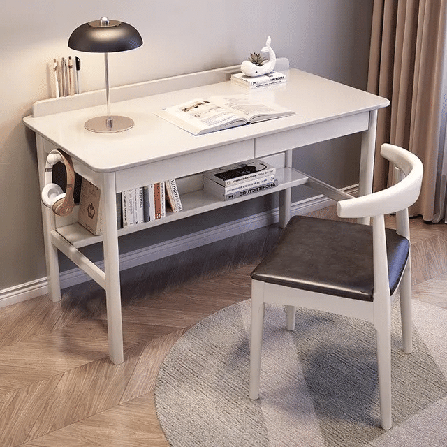

# 📖 欢迎来到我们的阅读空间

在喧嚣中寻找宁静，在文字里遇见自己。
这里是属于我们的数字读书角落，记录我们与书本相遇的瞬间。
欢迎你的到来

> “阅读是一座随身携带的避难所。” —— 毛姆

> “书籍是人类进步的阶梯。” —— 高尔基

> “读书有三到，谓心到，眼到，口到。” —— 朱熹

> “读万卷书，行万里路。” —— 顾炎武

---

## 📸 多媒体展示区

### 1. 阅读环境

### 2. 读书时的一段轻音乐 (Audio)
<audio controls style="width: 100%; margin: 10px 0;">
  <source src="assets/bgm.mp3" type="audio/mpeg">
  您的浏览器暂不支持播放音频。
</audio>

---

